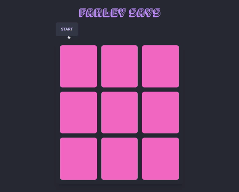
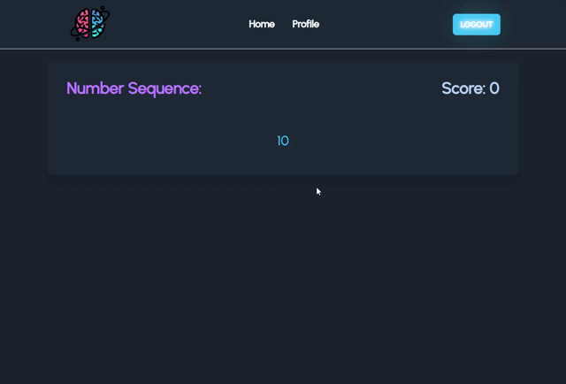

# memorize-me

## Description
Want to help grow your Hippocampus? Engage your Cerebrum? Try these games! Train and test your brain with these memory games. Each game is designed to help you increase your memory. How much can you memorize with each game? Test yourself.

## Usage

## Installation
npm install
react
## Contributors
Amnider Kaur (github: https://github.com/akaur09)
Christian Schroeder (github: https://github.com/cmwschroeder)
Walter A Underwood (github: https://github.com/Wau00)

## Lisence
MIT License

Copyright (c) [2022] 

Permission is hereby granted, free of charge, to any person obtaining a copy of this software and associated documentation files (the "Software"), to deal in the Software without restriction, including without limitation the rights to use, copy, modify, merge, publish, distribute, sublicense, and/or sell copies of the Software, and to permit persons to whom the Software is furnished to do so, subject to the following conditions:

The above copyright notice and this permission notice shall be included in all copies or substantial portions of the Software.

THE SOFTWARE IS PROVIDED "AS IS", WITHOUT WARRANTY OF ANY KIND, EXPRESS OR IMPLIED, INCLUDING BUT NOT LIMITED TO THE WARRANTIES OF MERCHANTABILITY, FITNESS FOR A PARTICULAR PURPOSE AND NONINFRINGEMENT. IN NO EVENT SHALL THE AUTHORS OR COPYRIGHT HOLDERS BE LIABLE FOR ANY CLAIM, DAMAGES OR OTHER LIABILITY, WHETHER IN AN ACTION OF CONTRACT, TORT OR OTHERWISE, ARISING FROM, OUT OF OR IN CONNECTION WITH THE SOFTWARE OR THE USE OR OTHER DEALINGS IN THE SOFTWARE.
